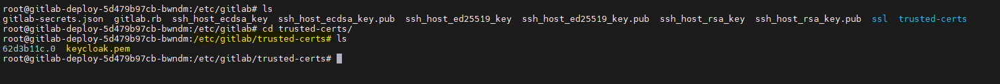
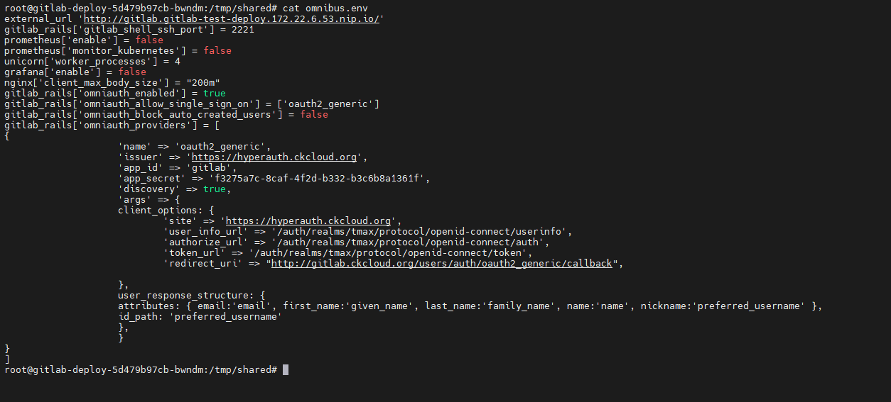

# OIDC 추가 연동 가이드 

## Prerequisite

* gitlab installed
* hyperauth installed
* OIDC.crt 

## 연동 가이드

1. gitlab pod에 접근하기

```bash
$ podName=$(kubectl get po -n ${NAMESPACE} | awk '{print $1}' | sed -n 2,3p)
$ kubectl exec -it -n ${NAMESPACE} ${podName} -- bin/bash
```
---

2. keycloak crt 추가하기

```bash
# cert 폴더 생성하고 해당 디렉토리 내, crt파일 추가해주기 
$ mkdir -p /etc/gitlab/trusted-certs
```

- 참고 사진

  
---
3. gitlab config  - OIDC 연동 설정 추가하기 

```bash
$ cd tmp/shared/
$ vi omnibus.env
---
# 해당 내용 추가
gitlab_rails['omniauth_enabled'] = true
gitlab_rails['omniauth_allow_single_sign_on'] = ['oauth2_generic']
gitlab_rails['omniauth_block_auto_created_users'] = false
gitlab_rails['omniauth_providers'] = [
{
'name' => 'oauth2_generic',
'issuer' => '{HYPERAUTH_주소}',
'app_id' => '{HYPERAUTH_CLIENT명}',
'app_secret' => '{CLIENT_CONFIDENTIAL}',
'discovery' => true,
'args' => {
client_options: {
'site' => '{HYPERAUTH_주소}',
'user_info_url' => '/auth/realms/tmax/protocol/openid-connect/userinfo',
'authorize_url' => '/auth/realms/tmax/protocol/openid-connect/auth',
'token_url' => '/auth/realms/tmax/protocol/openid-connect/token',
'redirect_uri' => "{외부노출주소}/users/auth/oauth2_generic/callback",
},
user_response_structure: {
attributes: { email:'email', first_name:'given_name', last_name:'family_name', name:'name', nickname:'preferred_username' },
id_path: 'preferred_username'
},
}
}
]
```

- 참고 사진


---
4. 깃랩 재설정

```bash
$ /assets/wrapper
```
